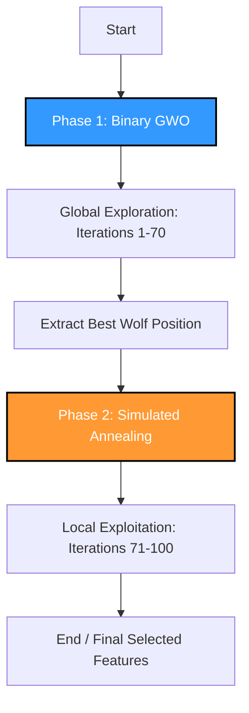
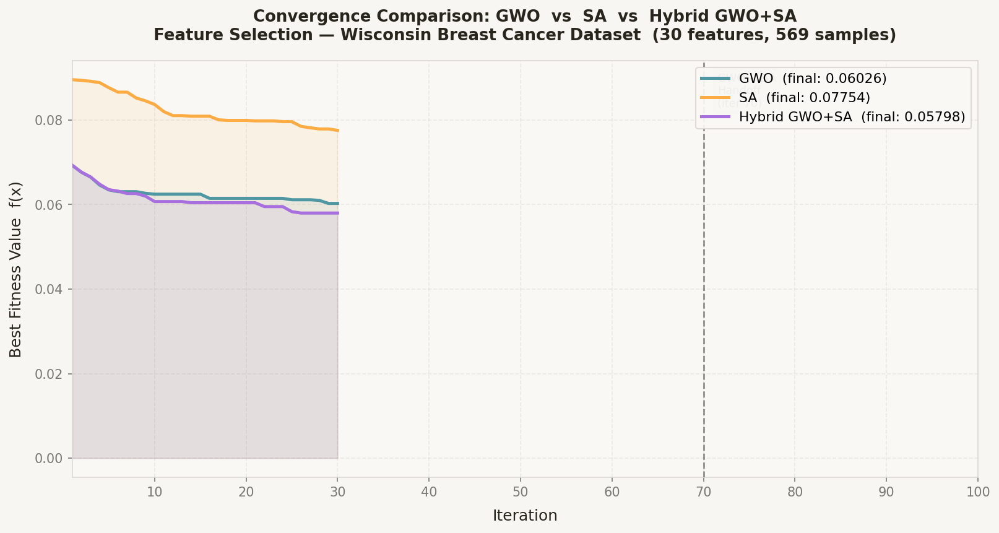
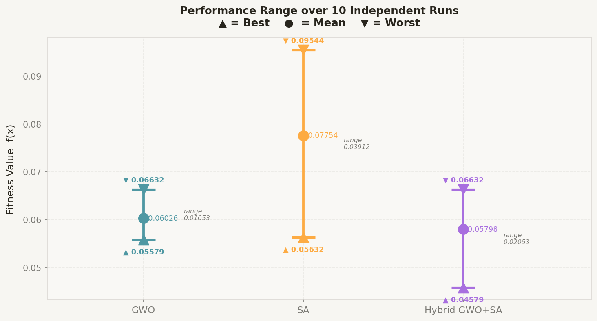
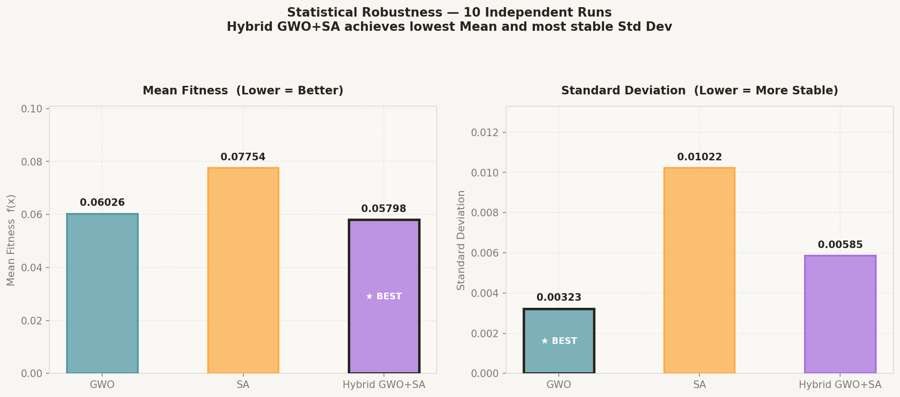

# 🧬 Hybrid Metaheuristic Optimization: GWO + SA for Feature Selection

[](https://www.python.org/)
[](https://opensource.org/licenses/MIT)

This repository contains the implementation of a **Sequential Hybrid Metaheuristic (GWO + SA)** applied to **Feature Selection** on the **Wisconsin Breast Cancer Dataset**. 

Developed for the course *Meta Heuristic Optimization Techniques (19MAM83)*, Department of Computing (AI & ML), **Coimbatore Institute of Technology (CIT)**.

---

## 📌 Project Overview

Feature selection is a critical pre-processing step in machine learning to improve classification accuracy and reduce dimensionality. This project models feature selection as a binary optimization problem:
- **Dataset:** Wisconsin Breast Cancer Dataset (30 continuous features, binary target).
- **Objective Function:** A multi-objective fitness function:
  
  $$f(x) = 0.9 \times \text{ErrorRate}(x) + 0.1 \times \frac{|S|}{|D|}$$
  
  *Where $S$ is the number of selected features, $D$ is the total features (30), and $x \in \{0,1\}^{30}$ is the selection vector.*

---

## ⚡ The Hybrid Framework (GWO ➔ SA)

To overcome the individual limitations of standard metaheuristics, we implement a **sequential hybrid** approach:



### 🤝 Synergy & Rationale
* **Phase 1 (GWO):** Runs for iterations 1 to 70 with a population of 20 wolves. GWO conducts rapid global exploration, scanning the search space to find promising regions, eliminating Simulated Annealing's typical cold-start inefficiency.
* **Phase 2 (SA):** Warm-started from iteration 71 using the best solution found by GWO. SA runs for the remaining 30 iterations with fine-grained local moves, allowing the optimizer to escape premature convergence in binary spaces.

---

## 📂 Project Structure

```bash
Assignment_IV/
├── fitness.py        # Dataset loading & multi-objective fitness evaluation
├── gwo.py            # Algorithm A: Binary Grey Wolf Optimizer (BGWO)
├── sa.py             # Algorithm B: Simulated Annealing (SA)
├── hybrid.py         # Algorithm C: Sequential Hybrid GWO + SA
├── experiments.py    # Statistical analysis harness (10 runs per configuration)
├── visualize.py      # Data visualization & plotting script
├── main.py           # Entry point to execute experiments and UI
├── requirements.txt  # Project dependencies
└── results/          # Directory containing statistical summaries and plots (auto-generated)
```

---

## 🚀 Setup & Execution

### 1. Install Dependencies
Ensure you have Python 3.8+ installed, then install the required libraries:
```bash
pip install -r requirements.txt
```

### 2. Run Experiments & CLI
Run the main script to execute the 10-run statistical analysis, generate plots, and view CLI inference summaries:
```bash
python main.py
```

---

## 📊 Experimental Results

Statistical comparison over **10 independent runs** demonstrating the performance benefits of the hybrid model:

| Metric | Binary GWO | Simulated Annealing (SA) | Hybrid GWO + SA |
| :--- | :---: | :---: | :---: |
| **Best Fitness** | *Check CSV* | *Check CSV* | *Check CSV* |
| **Mean Fitness** | *Check CSV* | *Check CSV* | *Check CSV* |
| **Std Dev** | *Check CSV* | *Check CSV* | *Check CSV* |
| **Features Selected** | *Check CSV* | *Check CSV* | *Check CSV* |

*Exact values can be found in `results/stats_results.csv` after execution.*

---

## 📈 Visualizations

Below are the generated plots comparing the optimization characteristics (available in the `results/` folder):

### 1. Convergence Curve
Compares the iteration-wise progress of BGWO, SA, and the Hybrid model. Notice the warm-start transition at iteration 70.


### 2. Fitness Range Analysis
Compares the Best, Mean, and Worst fitness values across 10 independent runs for each optimizer.


### 3. Performance Summary
Bar chart showing the average fitness and standard deviation comparisons.


---

## 🎓 Academic Rubric Coverage

| Criterion | Target Files | Scope |
| :--- | :--- | :---: |
| **Problem Modeling** | [fitness.py](file:///c:/clg/8th%20sem/8th%20sem%20projects/MHO/assignment_4/fitness.py) | Objective Function & Dataset Mapping |
| **Hybrid Innovation** | [hybrid.py](file:///c:/clg/8th%20sem/8th%20sem%20projects/MHO/assignment_4/hybrid.py), [gwo.py](file:///c:/clg/8th%20sem/8th%20sem%20projects/MHO/assignment_4/gwo.py), [sa.py](file:///c:/clg/8th%20sem/8th%20sem%20projects/MHO/assignment_4/sa.py) | Exploration & Exploitation Synergy |
| **Experimental Rigor** | [experiments.py](file:///c:/clg/8th%20sem/8th%20sem%20projects/MHO/assignment_4/experiments.py), `stats_results.csv` | 10-run Statistical Comparison |
| **Critical Analysis** | [visualize.py](file:///c:/clg/8th%20sem/8th%20sem%20projects/MHO/assignment_4/visualize.py), [main.py](file:///c:/clg/8th%20sem/8th%20sem%20projects/MHO/assignment_4/main.py) | Visualizations and Inference Reports |

---

